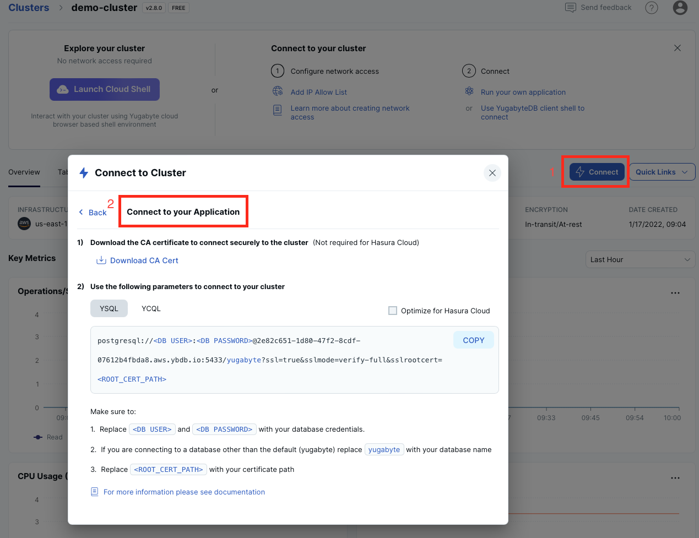

# Simple Ruby Application for YugabyteDB

This application connects to your YugabyteDB instance via the 
[Ruby Pg](https://github.com/ged/ruby-pg) driver for PostgreSQL and performs basic SQL operations. The instructions below are provided for [YugabyteDB Managed](https://cloud.yugabyte.com/) deployments. 
If you use a different type of deployment, then update the `sample-app.rb` file with proper connection parameters.

## Prerequisites

* Ruby 3.1 or later.
* OpenSSL 1.1.1 or later (used by libpq and Ruby Pg to establish SSL connections).
* [libpq](https://docs.yugabyte.com/latest/reference/drivers/ysql-client-drivers/#libpq) - the official PostgreSQL driver for C (required by Ruby Pg).
* [Ruby Pg](https://github.com/ged/ruby-pg) - the official Ruby driver for PostgreSQL.
* Command line tool or your favourite IDE, such as Visual Studio Code.

## Start YugabyteDB Managed Cluster

* [Start YugabyteDB Managed](https://docs.yugabyte.com/latest/yugabyte-cloud/cloud-quickstart/qs-add/) instance. You can use
the free tier at no cost.
* Add an IP address of your machine/laptop to the [IP allow list](https://docs.yugabyte.com/latest/yugabyte-cloud/cloud-secure-clusters/add-connections/#manage-ip-allow-lists)

## Clone Application Repository

Clone the repository and change dirs into it:

```bash
git clone https://github.com/yugabyte/yugabyte-simple-ruby-app && cd yugabyte-simple-ruby-app
```

## Provide Cluster Connection Parameters

Locate and define the following connection parameters in the `sample-app.rb` file:
* `host` - the hostname of your instance.
* `user` - the username for your database.
* `password` - the password for your database.
* `sslmode`  - an SSL mode. Make sure it's set to `verify-full`.
* `sslrootcert` - a full path to your CA root cert (for example, `/Users/dmagda/certificates/root.crt`). 

Note, you can easily find all the settings on the YugabyteDB Managed dashboard:



## Run the Application
 
1. Install the [libpq](https://docs.yugabyte.com/latest/reference/drivers/ysql-client-drivers/#libpq) driver (required by Ruby Pg):
    * Homebrew users can install using the `brew install libpq` command (find details [here](https://formulae.brew.sh/formula/libpq)).
    * Others can download the PostgreSQL binaries and source from the [PostgreSQL Downloads](https://www.postgresql.org/download/) page.

2. Replace `{path-to-libpq}` with the path to the libpq installation and install [Ruby Pg](https://github.com/ged/ruby-pg):
    ```bash
    gem install pg -- --with-pg-include={path-to-libpq}/libpq/include --with-pg-lib={path-to-libpq}/libpq/lib
    ```

    Find alternative installation instructions [here](https://github.com/ged/ruby-pg#label-How+To+Install).

4. Make the application file executable:
    ```bash
    chmod +x sample-app.rb
    ```

3. Run the application:
    ```bash
    ./sample-app.rb
    ```

Upon successful execution, you will see output similar to the following:

```bash
>>>> Connecting to YugabyteDB!
>>>> Successfully connected to YugabyteDB!
>>>> Successfully created table DemoAccount.
>>>> Selecting accounts:
name=Jessica, age=28, country=USA, balance=10000
name=John, age=28, country=Canada, balance=9000
>>>> Transferred 800 between accounts.
>>>> Selecting accounts:
name=Jessica, age=28, country=USA, balance=9200
name=John, age=28, country=Canada, balance=9800
```

## Explore Application Logic

Congrats! You've successfully executed a simple Ruby app that works with YugabyteDB.

Now, explore the source code of `sample-app.rb`:
1. `connect` function - establishes a connection with your cloud instance via the Ruby Pg driver.
2. `create_database` function - creates a table and populates it with sample data.
3. `select_accounts` function - queries the data with SQL `SELECT` statements.
4. `transfer_money_between_accounts` function - updates records consistently with distributed transactions.

## Questions or Issues?

Having issues running this application or want to learn more from Yugabyte experts?

Join [our Slack channel](https://communityinviter.com/apps/yugabyte-db/register),
or raise a question on StackOverflow and tag the question with `yugabytedb`!
